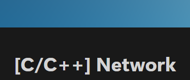

# $\large\bf\color{#556B2F}{\textsf{C/Cpp\ Socket\ Programming}}$

### $\large\bf\color{#CD5C5C}프로젝트\ 명$
Socket Chat

### $\large\bf\color{#CD5C5C}프로젝트\ 인원$
1명 (김기훈)

### $\large\bf\color{#CD5C5C}프로젝트\ 기간$
2024/10/22 ~ ing

### $\large\bf\color{#CD5C5C}목적$
① C/C++ 기반의 소켓 프로그래밍 학습 
② C/C++ 을 활용한 기능 구현 및 응용 능력 향상 
③ Winsock, Boost Asio 라이브러리 학습 
<!-- ④   -->

### $\large\bf\color{#CD5C5C}진행 계획$
1주차 : Winsock 라이브러리 학습
 
2주차 : Boost Asio 라이브러리 학습
 
3주차 : 채팅 프로그램 제작준비 및 학습
 
4주차 : 채팅 프로그램 제작...

### $\large\bf\color{#CD5C5C}결과물$
<b>[ Notion URL ]</b> 
$\color{#4F4F4F}(\ ↓ 이미지\ 클릭시\ 해당\ 페이지로\ 이동합니다.↓\ )$ 

 

<b>[ 기술문서 URL ]</b> 
yet...
 

### $\large\bf\color{#CD5C5C}타임라인$
<b>24/10/22 :</b> 
[프로젝트 시작] 
-&nbsp;Winsock 을 활용한 TCP 기반 프로젝트 생성 및 업로드 

<!--
<b>24/00/00 :</b> 
-&nbsp; 
-->
